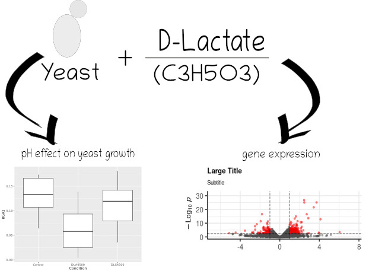
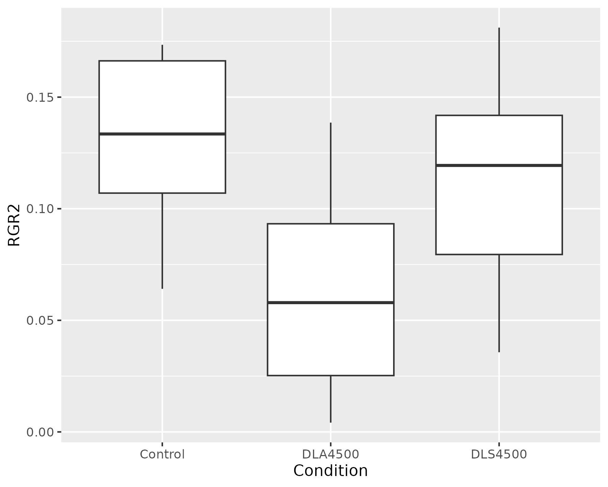
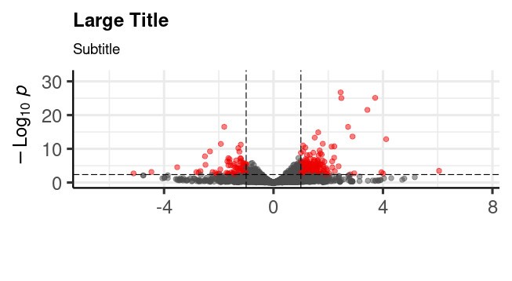
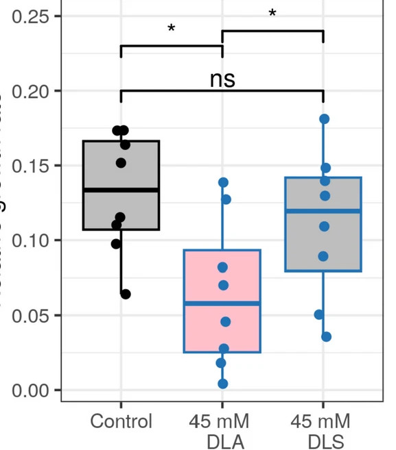

# S_cerevisiae_DLA_Response
Transcriptomic response of Saccharomyces cerevisiae to D-lactic acid
# Transcriptional Response of Saccharomyces cerevisiae to D-lactic Acid

## Резюме
Модель дрожжей S. cerevisiae является популярным объектом для разных исследований. Однако, некоторые транскрипционные ответы S. cerevisae на различные вещества не до конца изучены. Авторы данного исследования изучают транскрипционный ответ штамма BY4742 на широкий диапазон концентраций DLA и сравнивают его с ответом на L-молочную кислоту (LLA) (от 5 до 45 мМ) и влияние pH на выживаемость дрожжей. Полученные ими данные не выявили естественные дрожжевые промоторы, количественно распознающие DLA, но дают первое описание транскриптомного ответа на DLA и дают лучшего понимания ответа LLA. Так же их анализы показали, что некоторые из генов активируются кислой формой DLA, что в свою очередь раскрывает роль pH. Целью данного микропроекта является изучение транскрипционного ответа штамма BY4742 на концентрацию D-молочной кислоты (DLA) 5 мМ и влияние на рост дрожжей pH.

 


## Методы

Использованные программы: 

  * `R v4.1.2`;
  * `ggplot v3.5.0`.
    
Скачиваем данные из статьи "Drozdova P. et al. Transcriptional response of Saccharomyces cerevisiae to lactic acid enantiomers //Applied Microbiology and Biotechnology. – 2024.": 

`fasterq-dump --threads 2 -A --progress SRR24466389; fasterq-dump --threads 2 -A --progress SRR24466390; fasterq-dump --threads 2 -A --progress SRR24466391; fasterq-dump --threads 2 -A --progress SRR24466380; fasterq-dump --threads 2 -A --progress
SRR24466381; fasterq-dump --threads 2 -A --progress SRR24466382`

Выравниваем чтения на референс:

` wget https://ftp.ensembl.org/pub/release-108/gtf/saccharomyces_cerevisiae/Saccharomyces_cerevisiae.R64-1-1.108.gtf.gz
Wget
https://ftp.ensembl.org/pub/release-108/fasta/saccharomyces_cerevisiae/dna/Saccharomyces_cerevisiae.R64-1-1.dna.tople
vel.fa.gz`

Распаковываем архивы:

`gunzip Saccharomyces_cerevisiae.R64-1-1.dna.toplevel.fa.gz
gunzip Saccharomyces_cerevisiae.R64-1-1.108.gtf.gz`

Cоздаём индекс и готовим файл с данными сплайсинга в hisat2:

`hisat2-build Saccharomyces_cerevisiae.R64-1-1.dna.toplevel.fa yeast_index
hisat2_extract_splice_sites.py Saccharomyces_cerevisiae.R64-1-1.108.gtf > yeast_splice_sites.txt`

Выравниваем с помощью hisat2 и сортируем bam-файл с помощью samtools:

`for sample in `ls *_1.fastq`; do base=$(basename $sample "_1.fastq"); hisat2 -x yeast_index --known-splicesite-infile
yeast_splice_sites.txt -p 8 -1 ${base}_1.fastq -2 ${base}_2.fastq | samtools view --threads 2 -bS | samtools sort
--threads 2 -o $base.bam; done`

Графики строили с помощью R: 
```{r}


#Картинка по дрожжам
#Запускаем пакет
library(ggplot2)
#читаем файл (нужные данные к рис. 4 на листе 3)
yeast.growth <- read.xlsx("253_2023_12863_MOESM2_ESM.xlsx", sheet = 3)
#Боксплот_статья_дрожжи (без статистики, ввиду того, что версия R на моем компьютере устарела для ggpubr)
ggplot(yeast.growth, aes(x= Condition, y=RGR2)) + #данные для графика
  geom_boxplot()
сохраняем график
ggsave("Дрожжи.png", width = 15 (ширина), height = 12 (высота), units = "cm", dpi = 300 (разрешение))


#ВулканоПлот
#Установка (делаем ОДИН РАЗ!!!!!)
install.packages("BiocManager") #Установка (делаем ОДИН РАЗ!!!!!)
BiocManager::install("EnhancedVolcano") #Установка (делаем ОДИН РАЗ!!!!!)
BiocManager::install("DESeq2") #Установка (делаем ОДИН РАЗ!!!!!)

#Загружаем данные в R
count_table <- read.delim("allSamples.featureCounts.txt", skip=1, row.names="Geneid")

#Загружаем Sample data
sample_table <- data.frame(condition=c("DL", "DL", "DL", "control", "control",
                                       "control"))
#Анализ данных Dseq2
library(DESeq2) #нужно запускать каждый сеанс (когда открываешь R)
#Создаю матрицу для Dseq2
ddsFullCountTable <- DESeqDataSetFromMatrix(
  countData = count_table[,6:11], colData = sample_table, design = ~ condition)
#Анализ дифф экспрессии
dds <- DESeq(ddsFullCountTable)
#Результаты
res <- results(dds)


#Визуализация, постройка ВулканоПлота
library(EnhancedVolcano) #нужно запускать каждый сеанс (когда открываешь R)
#Сама постройка графика
EnhancedVolcano(res, lab = rownames(res),
                x = 'log2FoldChange', y = 'pvalue',
                pCutoff=0.05, pCutoffCol = 'padj', FCcutoff = 1,
                title="Large Title", subtitle="Subtitle",
                col = c("grey30", "grey30", "grey30", "red2"),
                xlab="", ylab = bquote(~-Log[10] ~ italic(p)),
                caption="", selectLab = "", legendPosition = 'none')


#Сортировка и запись данных
DEGs <- res[abs(res$log2FoldChange) > 1 & res$padj < 0.05 & complete.cases(res$padj), ]
DEGs <- DEGs[order(DEGs$log2FoldChange), ]

library(openxlsx) #нужно запускать каждый сеанс (когда открываешь R)
write.xlsx(x = DEGs, file = "DEGs_yeast.xlsx", rowNames = TRUE)
```


## Результаты и обсуждение
В результате проделанного анализа получены следующие результаты:

Проверка замедления роста дрожжей, вызванное, предполагаемо сдвигом pH в более кислую среду. 
DLА и D-лактат натрий (DLS)(45mM) (концентрация дополнительного NaCl в среде была скорректирована до 150 мМ).
И как показано на графике, замедление действительно было связано с pH.
 


Обзор изменений экспрессии генов. 

X — log2(изменение экспрессии)

Y — log10 p-значения с поправкой.


Ответ на 5 mM DLA (125 и 113 дифференциально экспрессированных генов (ДЭГ))
 

В оригинальной статье результаты представлены следующим образом:


.jpg)

## Список литературы

  - Drozdova, P., Gurkov, A., Saranchina, A., Vlasevskaya, A., Zolotovskaya, E., Indosova, E., ... & Borvinskaya, E. (2024). Transcriptional response of Saccharomyces cerevisiae to lactic acid enantiomers. Applied Microbiology and Biotechnology, 108(1), 121. [https://doi.org/10.1007/s00253-023-12863-z]


